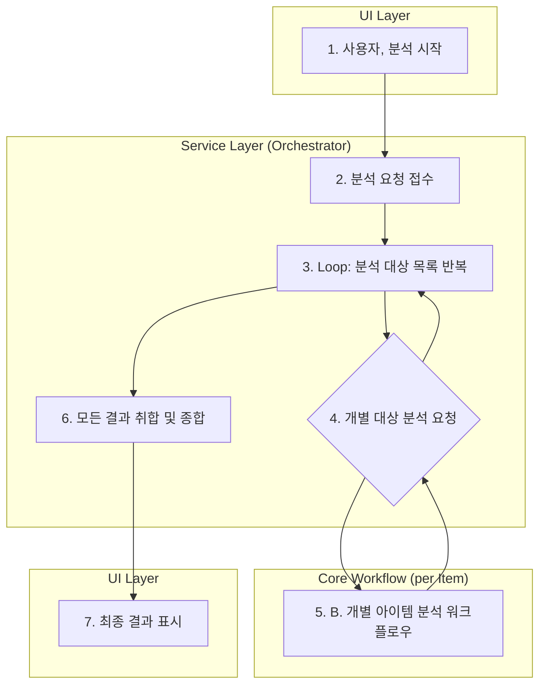
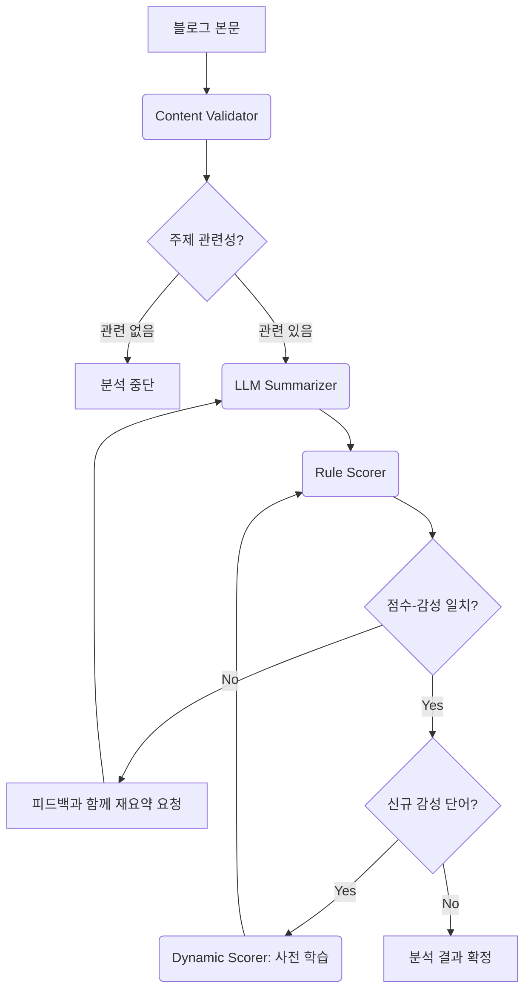

# 🚀 LLM 우선 네이버 블로그 감성 분석기 (GradioNaverSentiment)


## 🌟 프로젝트 소개

**GradioNaverSentiment**는 네이버 블로그 리뷰의 감성을 심층적으로 분석하는 지능형 웹 애플리케이션입니다. 사용자는 특정 **키워드**나 **카테고리**를 통해 원하는 주제의 후기들을 분석하고, 그 결과를 다각적인 시각 자료와 데이터로 확인할 수 있습니다. 

특히 이 프로젝트는 **LLM 우선 아키텍처**를 채택하여 단순한 단어 매칭을 넘어, 문장의 전체적인 문맥과 뉘앙스를 파악하는 데 중점을 둡니다. 또한, 대규모 코드 리팩토링을 통해 **클린 아키텍처(Clean Architecture)**를 도입하여 기능의 확장과 유지보수가 용이한 안정적인 구조를 갖추었습니다.

## ✨ 주요 기능

### 1. 4가지 강력한 분석 모드
사용자의 필요에 따라 유연하게 분석 방식을 선택할 수 있습니다.
*   **단일 키워드 분석**: 특정 키워드(예: `제주도 핫플`)에 대한 여론을 심층 분석합니다.
*   **키워드 비교 분석**: 두 키워드에 대한 여론을 나란히 놓고 비교합니다.
*   **카테고리별 분석**: `자연과계절 > 벚꽃 > 벚꽃 · 벚꽃길`처럼 세분화된 카테고리를 선택하여, 관련 축제 그룹 전체의 감성을 종합적으로 분석합니다.
*   **카테고리별 비교 분석**: 두 카테고리 그룹의 여론을 직관적으로 비교 분석합니다.

### 2. 한눈에 보는 상세 분석 리포트
분석 결과는 사용자가 쉽게 인사이트를 얻을 수 있도록 다양한 형태로 제공됩니다.
*   **종합 분석**: 전체 긍/부정 비율을 도넛 차트로 시각화합니다.
*   **계절별 분석**: 후기를 `봄/여름/가을/겨울`로 나누어 계절별 감성 경향을 비교합니다. (데이터가 있는 계절의 차트만 동적으로 표시)
*   **부정 의견 요약**: LLM이 모든 부정적 리뷰를 분석하여 **핵심 불만 사항**을 목록 형태로 요약합니다.
*   **상세 결과 테이블**: 분석에 사용된 **모든 블로그 리뷰**의 상세 내용과 **축제별 요약**을 표 형태로 제공하며, 페이지네이션을 지원합니다.

### 3. 모든 결과의 CSV 다운로드
"데이터는 당신의 것"이라는 원칙 하에, 화면에 표시되는 **모든 종류의 데이터**를 각각의 **CSV 파일로 다운로드**할 수 있습니다.
*   `종합 분석 데이터`, `계절별 분석 데이터`, `부정 의견 요약`, `축제별 요약 목록`, `전체 블로그 목록`

### 4. LLM 기반의 지능형 분석 엔진
`LangGraph`를 활용한 에이전트 시스템이 분석의 정확성과 깊이를 더합니다.
*   **지능형 컨텐츠 검증**: LLM이 사용자의 검색 의도와 일치하는 '진짜 후기'인지 사전 검증합니다.
*   **문맥 기반 요약**: 감성 표현과 그 수식 관계(`****아주****(수식어구: 멋진) ****멋진****`)를 명시적으로 추출하여 요약의 질을 높입니다.
*   **자체 피드백 및 동적 학습**: 분석 결과의 불일치를 스스로 감지하여 재요약하고, 새로운 감성 표현을 발견하면 사전에 동적으로 추가하며 학습합니다.

### 5. 사용자 편의 기능
*   **상세 로그 출력**: UI의 체크박스를 통해 에이전트의 모든 작동 과정을 터미널에서 실시간으로 확인할 수 있어, 내부 동작을 투명하게 파악할 수 있습니다.

## 🏗️ 아키텍처 설명

### 1. 클린 아키텍처 (Clean Architecture)

프로젝트 전체가 클린 아키텍처 원칙에 따라 리팩토링되었습니다. 코드는 역할과 의존성 방향에 따라 `src` 폴더 내의 `domain`, `application`, `infrastructure`, `presentation` 레이어로 명확하게 분리되어, 코드의 결합도는 낮추고 응집도는 높인 유연한 구조를 갖추고 있습니다.

```
C:\Users\SBA\github\GradioNaverSentiment\
└── src
    ├── application/     # 애플리케이션의 핵심 비즈니스 로직 (Use Cases)
    ├── data/            # 데이터 로딩 및 관리
    ├── domain/          # 핵심 도메인 모델 (Entities)
    ├── infrastructure/  # 외부 서비스/라이브러리와의 연동 (DB, API, Scraper)
    └── presentation/    # 사용자 인터페이스 (UI)
```

### 2. 분석 워크플로우

본 애플리케이션의 분석 과정은 두 단계의 워크플로우로 구성됩니다.

**A. 상위 워크플로우: 분석 총괄**

사용자가 UI에서 분석을 시작하면, `Service Layer`가 전체 분석 과정을 조율합니다. 카테고리 분석의 경우, 해당 카테고리의 모든 축제에 대해 B 워크플로우를 반복 호출하고 결과를 취합합니다.



**B. 핵심 워크플로우: 단일 블로그 분석 (LangGraph)**

개별 블로그 포스트 하나를 분석하는 핵심 로직입니다. `LangGraph` 기반의 에이전트들이 "검증 → 요약 → 채점"의 파이프라인을 수행하며, 자체 피드백 루프를 통해 분석의 정확도를 높입니다.



## ⚙️ 설치 및 실행 방법

### 1. 환경 설정

프로젝트 루트 디렉토리에 `.env` 파일을 생성하고 아래와 같이 API 키를 설정합니다.

```
NAVER_CLIENT_ID=YOUR_NAVER_CLIENT_ID
NAVER_CLIENT_SECRET=YOUR_NAVER_CLIENT_SECRET
GOOGLE_API_KEY=YOUR_GOOGLE_API_KEY
```

### 2. 의존성 설치

Python 3.9 이상 환경에서 필요한 라이브러리를 설치합니다.

```bash
pip install -r requirements.txt
```

### 3. 애플리케이션 실행

```bash
python app_llm.py
```

터미널에 출력되는 URL(일반적으로 `http://127.0.0.1:7860`)로 접속하여 웹 UI를 사용할 수 있습니다.

## 🚀 활용 방법

1.  **분석 탭 선택**: 상단의 4개 탭(`단일 키워드`, `키워드 비교`, `카테고리별`, `카테고리 비교`) 중 원하는 분석 방식을 선택합니다.
2.  **대상 입력**: 키워드를 입력하거나, 분석할 카테고리를 `대분류`부터 순서대로 선택합니다.
3.  **분석 시작**: `분석 시작` 버튼을 클릭하여 분석을 실행합니다.
4.  **결과 확인 및 다운로드**: 
    *   분석이 완료되면 종합 분석 결과와 상세 테이블이 화면에 표시됩니다.
    *   각 결과물 옆에 있는 **다운로드 버튼**을 클릭하여 원하는 데이터를 CSV 파일로 저장할 수 있습니다.
5.  **(선택) 상세 로그 확인**: 에이전트의 자세한 작동 과정이 궁금하다면, '상세 로그 출력' 체크박스를 선택하고 분석을 실행하세요. 터미널에 모든 처리 과정이 출력됩니다.

## 📝 라이선스

이 프로젝트는 MIT 라이선스를 따릅니다.
