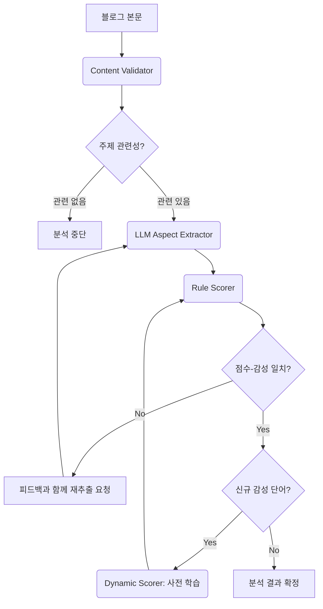

#  FestInsight - 축제 감성 분석 플랫폼


## 🌟 프로젝트 소개

**FestInsight**는 축제 기획자와 마케터를 위한 데이터 기반 의사결정 플랫폼입니다. 네이버 블로그 리뷰를 LLM(Google Gemini)과 규칙 기반 감성 분석으로 처리하여, 특정 축제나 주제에 대한 대중의 반응을 심층적으로 분석합니다.

본 프로젝트는 기존 Gradio 기반 UI를 **React(Vite) + FastAPI** 기반의 모던 웹 애플리케이션으로 완전히 전환하여, 사용자 경험과 확장성을 크게 향상시켰습니다.

## ✨ 주요 기능

### 1. 4가지 강력한 분석 모드
- **단일 키워드 분석**: 특정 키워드(예: `강릉커피축제`)에 대한 여론을 심층 분석합니다.
- **카테고리별 분석**: `계절과 자연 > 꽃`처럼 세분화된 카테고리를 선택하여, 관련 축제 그룹 전체의 감성을 종합적으로 분석합니다.
- **축제 비교 분석**: 두 개의 축제를 나란히 놓고 주요 지표를 비교하여 강점과 약점을 파악합니다.
- **계절별 인기 축제 탐색**: 네이버 트렌드 검색량 데이터를 기반으로 계절별(봄/여름/가을/겨울) 인기 축제 순위를 확인하고, 각 축제의 트렌드를 시각적으로 탐색합니다.

### 2. 한눈에 보는 상세 분석 리포트
- **만족도 5단계 분류**: IQR 통계 기법을 기반으로 리뷰 점수를 `매우 불만족`부터 `매우 만족`까지 5단계로 분류하여 정량적 평가를 제공합니다.
- **이상치 분석 (BoxPlot)**: 감성 점수 분포를 BoxPlot 차트로 시각화하여 극단적인 의견이나 스팸성 리뷰를 식별합니다.
- **LLM 기반 분포 해석**: LLM이 만족도 분포의 특징, 주요 인사이트, 개선 제안사항을 자연어로 요약해줍니다.
- **주체 기반 감성 워드클라우드**: '음식', '주차', '분위기' 등 긍정/부정 평가를 받은 '주체'를 각각의 워드클라우드로 시각화하여, 긍정/부정 여론의 핵심 원인을 직관적으로 보여줍니다.
- **상세 결과 테이블**: 분석에 사용된 모든 블로그 리뷰의 상세 내용과 점수를 표 형태로 제공하며, 페이지네이션을 지원합니다.

### 3. 모든 결과의 CSV 다운로드
화면에 표시되는 모든 종류의 데이터(종합 분석, 블로그 목록 등)를 각각의 **CSV 파일로 다운로드**하여 보고서 등에 활용할 수 있습니다.

## 🏗️ 아키텍처

### 1. 클린 아키텍처 (Clean Architecture)
백엔드는 클린 아키텍처 원칙에 따라 `domain`, `application`, `infrastructure`, `presentation`의 4개 레이어로 명확하게 분리되어 유지보수성과 확장성을 높였습니다.

```
GradioNaverSentiment/
└── src
    ├── application/     # 애플리케이션의 핵심 비즈니스 로직 (Use Cases)
    ├── data/            # 데이터 로딩 및 관리
    ├── domain/          # 핵심 도메인 모델 (Entities)
    ├── infrastructure/  # 외부 서비스/라이브러리와의 연동 (DB, API, Scraper)
    └── presentation/    # API 계층 (FastAPI)
```

### 2. 분석 워크플로우 (LangGraph)
`LangGraph` 기반의 에이전트 시스템이 "검증 → 주체/감성 추출 → 채점"의 파이프라인을 수행하며, 자체 피드백 루프를 통해 분석의 정확도를 높입니다.



## 🛠️ 기술 스택

### Backend
- **Framework**: FastAPI
- **Language**: Python 3.9+
- **AI/ML**: LangGraph, Google Gemini, Pandas
- **Web Scraping**: Selenium, BeautifulSoup
- **Database**: SQLite
- **Visualization**: Matplotlib, WordCloud

### Frontend
- **Framework**: React 18 + TypeScript
- **Build Tool**: Vite
- **Styling**: TailwindCSS
- **State Management**: TanStack Query (React Query)
- **Charting**: Recharts
- **Routing**: React Router DOM

## 🚀 설치 및 빠른 시작

### 1. 사전 준비
- **필수 요구사항**: Python 3.9+, Node.js 18+, Chrome 브라우저
- **API 키 준비**: 프로젝트 루트에 `.env` 파일을 생성하고 아래 내용을 채웁니다.
  ```
  GOOGLE_API_KEY=your_gemini_api_key
  NAVER_CLIENT_ID=your_naver_client_id
  NAVER_CLIENT_SECRET=your_naver_client_secret
  NAVER_TREND_CLIENT_ID=your_trend_client_id
  NAVER_TREND_CLIENT_SECRET=your_trend_client_secret
  ```

### 2. 백엔드 실행 (터미널 1)
```bash
# 1. 프로젝트 폴더로 이동
cd /path/to/GradioNaverSentiment

# 2. 가상환경 생성 및 활성화
python -m venv venv
# Windows
venv\Scripts\activate
# Mac/Linux
# source venv/bin/activate

# 3. 의존성 설치
pip install -r requirements.txt

# 4. 백엔드 서버 실행
python api_server.py
```
- **확인**: 브라우저에서 http://localhost:8001/docs 접속 시 Swagger UI가 보이면 성공입니다.

### 3. 프론트엔드 실행 (터미널 2)
```bash
# 1. 프론트엔드 폴더로 이동
cd /path/to/GradioNaverSentiment/frontend

# 2. 의존성 설치
npm install

# 3. 개발 서버 실행
npm run dev
```
- **확인**: 브라우저에서 http://localhost:5173 접속 시 FestInsight 홈페이지가 보이면 성공입니다.

### 4. 첫 분석 실행
1. 브라우저에서 http://localhost:5173 에 접속합니다.
2. "지금 시작하기" 버튼을 클릭하여 검색 페이지로 이동합니다.
3. **직접 검색** 탭에서 축제명(예: `강릉커피축제`)을 입력하고 "분석 시작"을 클릭합니다.
4. 약 2-3분 후, 분석 결과 페이지에서 다양한 차트와 데이터를 확인합니다.

## 📁 프로젝트 구조
```
GradioNaverSentiment/
├── api_server.py              # 벡엔드 서버 (FastAPI)
├── requirements.txt
├── .env                       # API 키 설정
│
├── src/                       # Python 백엔드 코드 (Clean Architecture)
│   ├── application/
│   ├── data/
│   ├── domain/
│   ├── infrastructure/
│   └── presentation/
│
├── frontend/                  # React 프론트엔드
│   ├── src/
│   │   ├── pages/             # 페이지 컴포넌트
│   │   ├── components/        # 재사용 컴포넌트
│   │   └── lib/api.ts         # API 클라이언트
│   └── package.json
│
├── database/                  # 데이터베이스 파일
└── festivals/                 # 축제 카테고리 (JSON)
```

## ⚠️ 문제 해결
- **`ModuleNotFoundError` 발생 시**: `pip install -r requirements.txt` 명령어를 실행했는지 확인하세요.
- **프론트엔드 실행 안될 시**: `npm install` 명령어를 실행했는지 확인하세요.
- **CORS 에러 발생 시**: 백엔드 서버(http://localhost:8001)가 먼저 실행되었는지 확인하세요.
- **분석 실패 시**: `.env` 파일에 API 키가 올바르게 입력되었는지, 축제명이 정확한지 확인하세요.

## 📄 라이선스
이 프로젝트는 교육 및 연구 목적으로 제작되었습니다. 상업적 사용을 금합니다.