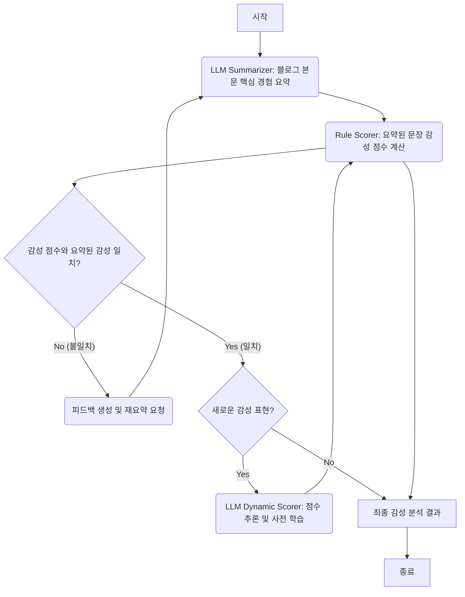

# 🚀 LLM 우선 네이버 블로그 감성 분석기 (GradioNaverSentiment)


## 🌟 프로젝트 소개

이 프로젝트는 네이버 블로그 게시글의 감성을 분석하기 위한 지능형 애플리케이션입니다. 사용자가 입력한 키워드를 기반으로 네이버 블로그를 검색하고, 스크래핑한 블로그 본문의 감성을 분석하여 긍정/부정 비율 및 상세 분석 결과를 제공합니다. 특히, **LLM(Large Language Model)을 우선적으로 활용하는 새로운 아키텍처**를 도입하여 문맥과 의도를 더욱 정확하게 파악하며, 동적으로 감성 사전을 확장하는 학습 기능을 포함하고 있습니다.

**주요 개선 사항**:
*   **세분화된 감성 적용**: 강조어, 완화어, 부정어가 문장 내 특정 감성 단어에 미치는 영향을 명확히 파악하여 점수를 계산합니다.
*   **자체 수정 및 피드백 루프**: 감성 분석 결과의 불일치(예: 긍정 문장이 음수 점수를 받는 경우)를 감지하고, LLM에게 피드백을 주어 요약을 자체적으로 개선하도록 합니다.

## ✨ 주요 기능

1.  **네이버 블로그 검색 및 스크래핑**:
    *   사용자 키워드에 따라 네이버 검색 API를 통해 관련 블로그 게시글을 검색합니다.
    *   Selenium과 BeautifulSoup을 활용하여 블로그 본문 내용을 안정적으로 스크래핑합니다.
2.  **LLM 우선 감성 분석 아키텍처**:
    *   **핵심 경험 요약 (LLM Summarizer)**: 블로그 본문에서 LLM이 핵심적인 긍정/부정 경험을 요약합니다. 이때 감성 강도에 영향을 미치는 표현들을 보존하며, **강조어/완화어/부정어가 어떤 감성 단어에 영향을 미치는지 명시**하도록 프롬프트가 설계되어 있습니다.
    *   **요약 기반 규칙 채점 (Rule Scorer)**: LLM이 요약한 내용을 바탕으로 규칙 기반의 감성 점수를 계산합니다. **세분화된 감성 적용 로직**을 통해 강조어/완화어/부정어의 효과를 특정 감성 단어에만 적용하여 정확도를 높입니다. 또한, 점수와 요약된 감성 간의 **불일치를 감지하고 LLM에게 피드백을 제공**하여 요약을 개선하도록 요청합니다.
3.  **동적 감성 사전 학습**:
    *   분석 과정에서 기존 사전에 없는 새로운 감성 표현(관용어, 형용사, 부사, 명사)이 발견되면, LLM에 질의하여 해당 표현의 감성 점수를 추론합니다.
    *   추론된 점수는 해당 카테고리의 CSV 파일(`idioms.csv`, `adjectives.csv`, `adverbs.csv`, `sentiment_nouns.csv`)에 자동으로 저장되어 감성 사전을 지속적으로 확장하고 분석 정확도를 높입니다.
4.  **Gradio 웹 UI**:
    *   직관적인 웹 인터페이스를 통해 키워드 입력, 분석 시작, 결과 확인(데이터프레임, URL 리스트, 상세 문장 분석)을 쉽게 할 수 있습니다.
    *   페이지네이션 기능을 통해 많은 분석 결과도 효율적으로 탐색할 수 있습니다.

## 🏗️ 아키텍처 설명

이 프로젝트는 `LangGraph`를 활용하여 에이전트 기반의 워크플로우를 구축했습니다. 특히, 감성 분석의 정확도를 높이기 위해 LLM의 요약과 규칙 기반 채점기 간의 **자체 수정 피드백 루프**를 도입했습니다.

### LLM 우선 감성 분석 워크플로우 (`app_llm.py`)

이 아키텍처는 LLM의 강력한 문맥 이해 능력을 최대한 활용하여 블로그 본문의 핵심 감성을 먼저 파악한 후, 규칙 기반 시스템으로 정량적인 점수를 부여합니다. 감성 점수와 요약된 감성 간의 불일치가 발생하면, LLM은 피드백을 받아 요약을 개선하는 과정을 반복합니다.



*   **LLM Summarizer**: 블로그 본문을 입력받아, `keyword`와 관련된 긍정적/부정적 핵심 경험을 요약합니다. 이때 프롬프트는 감성 표현(예: `****환상적****`)과 이를 수식하는 표현(예: `****정말****`)을 모두 `****`로 감싸고, 둘의 관계를 `(수식어구: 환상적)`과 같이 명시하도록 지시합니다. (예: `****정말****(수식어구: 환상적) ****환상적****이었어요.`) `Rule Scorer`로부터 불일치 피드백을 받으면, 이를 반영하여 최대 3회까지 요약을 재시도합니다.
*   **Rule Scorer**: LLM이 요약한 문장들을 개별적으로 분석하여 감성 점수를 계산합니다.
    *   **초기 점수**: 문장의 긍정/부정 뉘앙스에 따라 0.3 또는 -0.3으로 설정됩니다.
    *   **세분화된 감성 적용**: `****`로 마킹된 감성 단어의 점수를 누적합니다. `(수식어구: 대상)`으로 연결된 강조어/완화어/부정어의 효과는 해당 대상 단어에만 적용되며, **연결되지 않은 수식어는 점수 계산에 영향을 미치지 않습니다.**
    *   **일관성 검사 및 재계산**: 계산된 점수와 요약된 문장의 긍정/부정 컨텍스트 간 불일치(예: 긍정 문장이 음수 점수를 받는 경우)가 감지되면, 점수 계산을 한 번 더 시도합니다. 이는 첫 계산에서 새로운 감성 단어가 학습되었을 가능성을 반영하기 위함입니다.
    *   **피드백 생성**: 재계산 후에도 불일치가 지속되면, **즉시 분석을 중단**하고 LLM에게 구체적인 피드백을 제공하여 요약을 개선하도록 요청합니다.
*   **LLM Dynamic Scorer**: 새로운 감성 표현(관용어, 형용사, 부사, 명사)이 발견되면, LLM에게 해당 표현의 감성 점수를 추론하도록 요청합니다. 이때 점수 범위, 기존 사전의 예시, 품사 정보 등을 가이드로 제공하여 LLM이 일관되고 정확한 점수를 부여하도록 돕습니다. 추론된 점수는 해당 CSV 파일에 저장되어 사전을 확장합니다.

## ⚙️ 설치 및 실행 방법

### 1. 환경 설정

프로젝트 루트 디렉토리에 `.env` 파일을 생성하고 네이버 API 키를 설정합니다.

```
NAVER_CLIENT_ID=YOUR_NAVER_CLIENT_ID
NAVER_CLIENT_SECRET=YOUR_NAVER_CLIENT_SECRET
GOOGLE_API_KEY=YOUR_GOOGLE_API_KEY
```

*   `NAVER_CLIENT_ID`, `NAVER_CLIENT_SECRET`: 네이버 개발자 센터에서 발급받은 검색 API 키입니다.
*   `GOOGLE_API_KEY`: Google Gemini API 사용을 위한 키입니다.

### 2. 의존성 설치

Python 3.9 이상 환경에서 다음 명령어를 실행하여 필요한 라이브러리들을 설치합니다.

```bash
pip install -r requirements.txt
```

### 3. 애플리케이션 실행

LLM 우선 감성 분석기를 실행합니다.

```bash
python app_llm.py
```

터미널에 출력되는 URL(일반적으로 `http://127.0.0.1:7860`)로 접속하여 웹 UI를 사용할 수 있습니다.

## 🚀 활용 방법

1.  **키워드 입력**: 웹 UI의 "검색어" 입력창에 분석하고자 하는 키워드(예: `제주도 핫플`, `서울 축제`)를 입력합니다.
2.  **분석 시작**: "분석 시작" 버튼을 클릭하면 네이버 블로그 검색, 스크래핑, 감성 분석 과정이 진행됩니다.
3.  **결과 확인**:
    *   **분석 상태**: 현재 진행 상황을 실시간으로 확인할 수 있습니다.
    *   **수집된 전체 URL 리스트**: 분석에 사용된 블로그 게시글의 제목과 링크를 확인할 수 있습니다.
    *   **개별 블로그 분석 결과**: 각 블로그별 긍정/부정/중립 문장 수, 긍정 비율, 그리고 긍정/부정 문장 요약이 표 형태로 제공됩니다. 페이지네이션을 통해 여러 블로그의 결과를 탐색할 수 있습니다.
4.  **동적 사전 학습의 이점**:
    *   애플리케이션을 사용하면서 LLM이 새로운 감성 표현을 학습하고 CSV 파일에 저장하므로, 시간이 지남에 따라 분석 정확도가 향상됩니다.
    *   특히 신조어나 특정 분야의 감성 표현에 대한 대응력이 높아집니다.

## 📝 라이선스

이 프로젝트는 MIT 라이선스를 따릅니다. 자세한 내용은 `LICENSE` 파일을 참조하십시오.
