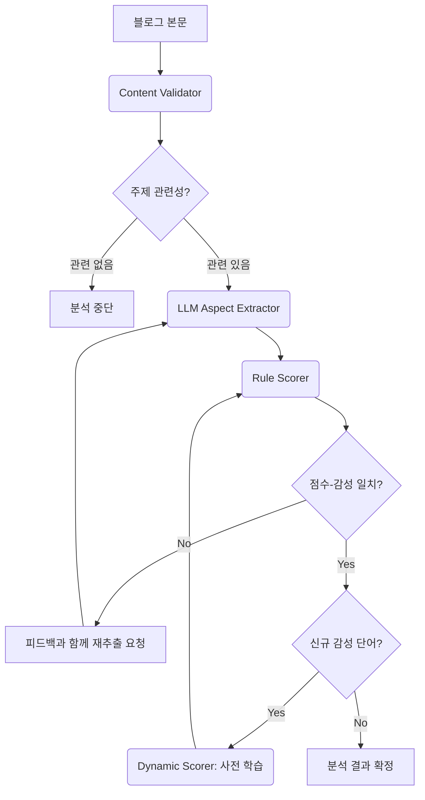

# 🎪 FestInsight - AI 기반 축제 감성 분석 플랫폼

<div align="center">


**데이터가 말해주는 진짜 축제 평가**
*네이버 블로그 리뷰 × AI 감성분석 × 트렌드 인사이트*

[🚀 빠른 시작](#-설치-및-빠른-시작) · [📖 문서](#-주요-기능) · [💡 활용 사례](#-활용-사례) · [🎯 기대 효과](#-기대-효과)

</div>

---

## 📋 목차

- [프로젝트 소개](#-프로젝트-소개)
- [기획 의도](#-기획-의도)
- [타겟 사용자](#-타겟-사용자)
- [주요 기능](#-주요-기능)
- [활용 사례](#-활용-사례)
- [기대 효과](#-기대-효과)
- [기술 스택](#-기술-스택)
- [아키텍처](#-아키텍처)
- [설치 및 빠른 시작](#-설치-및-빠른-시작)
- [프로젝트 구조](#-프로젝트-구조)
- [스크린샷](#-스크린샷)
- [문제 해결](#-문제-해결)
- [라이선스](#-라이선스)

---

## 🌟 프로젝트 소개

**FestInsight**는 축제 기획자와 관공서 담당자를 위한 **데이터 기반 의사결정 지원 플랫폼**입니다.

전국의 수많은 축제 중 어떤 축제가 실제로 방문객들에게 좋은 평가를 받고 있는지, 어떤 요소가 만족도를 높이고 어떤 점이 개선되어야 하는지를 **네이버 블로그 리뷰**와 **AI 감성 분석**을 통해 객관적이고 심층적으로 분석합니다.

### 💎 핵심 가치

- **📊 데이터 기반 의사결정**: 직관이 아닌 실제 방문객 후기 데이터로 축제를 평가합니다
- **🤖 AI 인사이트**: Google Gemini LLM이 수백 개의 리뷰를 분석하여 핵심 인사이트를 제공합니다
- **⚡ 시간 절약**: 수작업으로 수십 시간 걸릴 리뷰 분석을 단 2-3분으로 단축합니다
- **🎯 실행 가능한 제안**: 단순 분석을 넘어 지역과 계절에 맞는 구체적인 기획 방향을 제시합니다

---

## 💡 기획 의도

### 문제 인식

전국 지자체와 관공서에서는 매년 수천억 원의 예산을 투입하여 지역 축제를 개최합니다. 하지만:

- 📉 **객관적 평가 지표 부재**: 방문객 수 외에 만족도를 객관적으로 측정할 방법이 부족합니다
- 🔍 **벤치마킹의 어려움**: 유사한 타 지역 축제의 성공 요인을 파악하기 어렵습니다
- ⏰ **분석 시간과 비용**: 수작업 리뷰 분석에는 많은 시간과 인력이 소요됩니다
- 📝 **주관적 판단**: 담당자의 개인적 경험과 감각에 의존한 기획이 이루어집니다

### 솔루션

**FestInsight**는 이러한 문제를 해결하기 위해:

1. **자동화된 대량 리뷰 수집**: 네이버 블로그에서 축제 관련 최신 리뷰를 자동으로 수집합니다
2. **AI 감성 분석**: LLM과 규칙 기반 하이브리드 시스템으로 리뷰의 감성과 주제를 정확히 분석합니다
3. **통계적 분석**: IQR 기반 만족도 분류, 이상치 탐지 등 통계 기법을 적용합니다
4. **시각화 및 인사이트**: 차트, 워드클라우드, AI 해석을 통해 누구나 쉽게 이해할 수 있는 리포트를 생성합니다
5. **AI 추천 시스템**: 지역과 계절을 고려한 맞춤형 기획 방향을 제시합니다

---

## 👥 타겟 사용자

### 🏛️ 주요 타겟: 관공서 축제 기획 담당자

**시/군/구청 문화관광과, 축제추진위원회, 지역 문화재단 소속 담당자**

#### 활용 시나리오

1. **신규 축제 기획 단계**
   - 유사한 카테고리의 성공 축제 벤치마킹
   - 우리 지역과 계절에 맞는 축제 유형 선정
   - AI 추천을 통한 성공 가능성 사전 검증

2. **기존 축제 개선 단계**
   - 방문객들의 실제 불만 사항 파악
   - 타 지역 유사 축제와 비교 분석
   - 개선 우선순위 결정 (주차, 음식, 편의시설 등)

3. **예산 심의 및 보고 단계**
   - 데이터 기반 성과 보고서 작성
   - 타 지역 축제 대비 경쟁력 입증
   - 개선 방향에 대한 정량적 근거 제시

### 🎯 부가 타겟

- **이벤트/마케팅 기획사**: 클라이언트를 위한 축제 기획 시 데이터 분석
- **관광 연구기관**: 지역 축제 트렌드 연구 및 정책 제안
- **대학교 연구자**: 관광학, 데이터 분석 연구 자료
- **개인 블로거/유튜버**: 축제 콘텐츠 제작 시 인사이트 확보

---

## ✨ 주요 기능

### 🔍 1. 검색 (Search)

#### 1-1. 단일 축제 분석
특정 축제명(예: `강릉커피축제`)을 입력하여 심층 분석을 수행합니다.

**제공 정보**:
- 📊 **종합 지표**: 긍정/부정 문장 수, 평균 만족도 (5점 척도)
- 📋 **상세 정보**: 축제 주소, 기간, 감성 점수, 만족도 증감량
- 📈 **만족도 5단계 분포**: IQR 통계 기법으로 리뷰를 5등급으로 분류
- 📊 **절대 점수 분포**: 실제 감성 점수의 히스토그램 분포
- 📉 **이상치 분석 (BoxPlot)**: 극단적 의견 및 스팸성 리뷰 식별
- 🍩 **긍정/부정 비율 도넛 차트**: 전체 감성 비율 시각화
- 🤖 **AI 분포 해석**: LLM이 작성한 만족도 분포 인사이트
- 📝 **AI 종합 요약**: 축제에 대한 전반적 평가 및 핵심 강점
- ⚠️ **AI 불만 사항 요약**: 주요 개선 필요 사항 정리
- ☁️ **계절별 감성 워드클라우드**: 봄/여름/가을/겨울별 긍정/부정 키워드 시각화
- 📈 **트렌드 그래프**:
  - 전체 트렌드 (1년): 1년간 검색량 추이
  - 집중 트렌드 (±30일): 축제 기간 전후 검색량 집중 분석
  - 트렌드 지수: 행사 중/후 검색량 증감률
- 📑 **개별 블로그 결과 테이블**: 분석에 사용된 모든 리뷰의 상세 정보 (페이지네이션 지원)

#### 1-2. 카테고리 분석
3단계 계층 구조(예: `계절과 자연 > 꽃 > 매화`)로 카테고리를 선택하여 해당 카테고리의 **모든 축제를 종합 분석**합니다.

**제공 정보**:
- 🎯 **카테고리 종합 지표**: 전체 축제 수, 분석 완료 축제 수, 평균 만족도
- 📊 **단일 축제와 동일한 모든 차트**: 카테고리 전체에 대한 통합 분석
- ☁️ **Trend API 기반 계절별 워드클라우드**: 네이버 트렌드 데이터로 생성한 계절별 키워드
- ☁️ **블로그 내용 기반 계절별 키워드 워드클라우드**: 실제 블로그 리뷰에서 추출한 키워드 빈도 시각화 (NEW!)
- 📋 **개별 축제 분석 결과**: 카테고리 내 각 축제의 상세 분석 결과

### ⚖️ 2. 비교 (Comparison)

#### 2-1. 단일 축제 비교
두 개의 축제를 선택하여 나란히 비교 분석합니다.

**제공 정보**:
- 📊 **A vs B 병렬 차트**: 만족도 분포, 긍정/부정 비율을 양쪽에 배치
- 🔢 **주요 지표 비교**: 평균 만족도, 긍정/부정 문장 수 비교
- 📝 **AI 비교 요약**: 두 축제의 강점과 약점을 비교 설명

#### 2-2. 카테고리 비교 (병렬 처리)
두 개의 카테고리를 선택하여 비교 분석합니다. **병렬 처리**로 분석 시간을 절반으로 단축합니다.

**제공 정보**:
- 🎯 **카테고리 A vs B**: 전체/분석 축제 수, 평균 만족도 비교
- 📊 **병렬 차트**: 만족도 분포, 긍정/부정 비율, 계절별 데이터
- 📝 **AI 비교 분석**: 두 카테고리의 특성 및 강점 비교

### 📅 3. 계절별 트렌드 (Seasonal Trends)

네이버 트렌드 검색량 데이터를 기반으로 계절별 인기 축제를 탐색합니다.

**제공 정보**:
- ☁️ **계절별 워드클라우드**: 해당 계절에 가장 많이 검색된 축제 상위 120개 시각화
- 📈 **타임라인 그래프**: 계절별 상위 10개 축제의 검색량 추이
- 🏆 **상위 축제 테이블**: 순위, 축제명, 최대/평균 검색량, 행사 기간, 카테고리 정보
- 🔍 **개별 축제 트렌드**: 선택한 축제의 검색량 추이 그래프

### 🤖 4. AI 총합 분석 추천 (NEW!)

**모든 분석 결과 페이지 하단**에 "AI 총합 분석 추천" 섹션이 추가되었습니다.

#### 기능
사용자가 **지역**(예: 서울, 부산, 제주)과 **계절**(봄/여름/가을/겨울)을 입력하면, Google Gemini LLM이 해당 조건에서의 **맞춤형 기획 방향**을 제시합니다.

#### 단일 분석 추천 내용
- ✅ **성공 가능성 평가**: 상/중/하 등급으로 평가
- 📋 **핵심 기획 방향**: 3-5가지 구체적 실행 방안 (예: "주차장 공간을 넓게 확보해야 합니다")
- 🌍 **지역 특화 전략**: 해당 지역의 특성을 고려한 맞춤 전략
- 🌸 **계절 활용 전략**: 선택한 계절의 장점을 극대화하는 방법
- ⚠️ **예상 리스크 및 대응 방안**: 발생 가능한 문제와 해결책

#### 비교 분석 추천 내용
- 🔍 **종합 비교 분석**: A와 B의 강점과 약점 비교
- 🏆 **우수 사례**: A가 더 나은 점 / B가 더 나은 점
- 📍 **지역별 추천 순위**: 해당 지역에 적합한 순위 (1순위, 2순위)
- 📅 **계절별 추천 순위**: 해당 계절에 적합한 순위
- 💡 **최종 기획 방향 제안**: 어떤 것을 선택하고 어떻게 개선할지 구체적 제안

### ⚡ 5. 스마트 캐싱 시스템

동일한 축제를 여러 번 분석할 때 **로컬 캐시**를 활용하여 즉시 결과를 제공합니다.
- 🚀 **즉시 응답**: 이미 분석한 축제는 1초 이내 결과 표시
- 💾 **자동 저장**: 모든 분석 결과가 자동으로 로컬에 저장
- 🔄 **자동 갱신**: 리뷰 수 변경 시 새로운 분석 수행

### 🎨 6. 직관적인 UI/UX

- 📱 **반응형 디자인**: 모바일, 태블릿, PC 모든 환경 지원
- 🎯 **설명 토글**: 각 차트 옆에 "?" 아이콘 클릭 시 상세 설명 표시
- 📊 **인터랙티브 차트**: Recharts 기반의 아름답고 직관적인 차트
- 🌈 **시각적 피드백**: 로딩 스피너, 진행 상태 표시
- 📥 **CSV 다운로드**: 모든 데이터를 CSV로 내보내기 가능 (향후 지원)

---

## 📚 활용 사례

### 사례 1️⃣: 신규 꽃 축제 기획

**배경**: A 시청에서 봄철 매화 축제 개최를 검토 중

**FestInsight 활용**:
1. **카테고리 분석**: `계절과 자연 > 꽃 > 매화` 카테고리 전체 분석
2. **비교 분석**: 성공적인 타 지역 매화 축제 2개를 비교 분석
3. **AI 추천**: "우리 시, 봄" 조건으로 AI 기획 방향 도출

**결과**:
- ✅ 주차 공간 부족이 주요 불만임을 발견 → 사전에 셔틀버스 운행 계획 수립
- ✅ 사진 포토존이 만족도를 크게 높인다는 인사이트 → SNS 이벤트 기획
- ✅ AI 추천으로 지역 특산물과 연계한 체험 프로그램 아이디어 확보

### 사례 2️⃣: 기존 축제 개선

**배경**: B 군청의 전통 음식 축제가 3년째 방문객 감소

**FestInsight 활용**:
1. **단일 축제 분석**: 자체 축제의 리뷰 감성 분석
2. **불만 사항 확인**: AI 불만 사항 요약에서 핵심 문제 파악
3. **벤치마킹**: 유사한 성공 축제와 비교 분석

**결과**:
- ⚠️ "음식 가격이 비싸다", "대기 시간이 길다"는 반복적 불만 발견
- ✅ 가격 조정 및 사전 예약제 도입으로 만족도 향상
- ✅ 성공 축제의 "체험 프로그램" 벤치마킹하여 새로운 콘텐츠 도입

### 사례 3️⃣: 예산 심의 자료 작성

**배경**: C 시의회 예산 심의에서 축제 예산 증액 필요

**FestInsight 활용**:
1. **트렌드 분석**: 계절별 인기 축제 검색량 추이 확인
2. **종합 리포트**: 방문객 만족도, AI 해석 등 객관적 데이터 확보
3. **개별 블로그 테이블**: 실제 리뷰 사례를 보고서에 첨부

**결과**:
- 📊 데이터 기반 설득력 있는 보고서 작성
- ✅ 정량적 지표로 예산 증액 승인
- 📈 객관적 성과 측정 지표 확보

---

## 🎯 기대 효과

### 🏛️ 관공서 및 지자체

| 항목 | 기존 방식 | FestInsight 도입 후 |
|------|----------|-------------------|
| 리뷰 분석 시간 | 수작업 20~30시간 | **자동화 2~3분** |
| 분석 정확도 | 주관적, 샘플링 오류 | AI + 통계 기법으로 **객관적** |
| 비용 | 외주 용역 500만원+ | **API 비용만 발생** (월 ~5만원) |
| 의사결정 근거 | 담당자 경험/감각 | **데이터 기반** |
| 벤치마킹 | 수동 조사, 한계 | **전국 축제 즉시 비교** |

### 💼 기대되는 구체적 효과

1. **예산 효율성 향상**
   - 불필요한 요소 축소, 필수 요소 강화로 예산 최적화
   - 성공 가능성 낮은 기획 사전 차단

2. **주민 만족도 증대**
   - 실제 방문객 의견 반영한 개선으로 만족도 상승
   - 불만 사항 사전 해결로 민원 감소

3. **관광 수입 증대**
   - 만족한 방문객의 재방문 및 입소문 효과
   - SNS 긍정 후기 증가로 홍보 효과

4. **업무 생산성 향상**
   - 담당자의 분석 업무 시간 절감
   - 데이터 기반 보고서 작성 시간 단축

5. **정책 설득력 강화**
   - 의회 및 상급 기관 보고 시 객관적 근거 제시
   - 주민 공청회 등에서 데이터로 설명

---

## 🛠️ 기술 스택

### 🖥️ Backend

| 분류 | 기술 | 역할 |
|------|------|------|
| **Framework** | FastAPI | REST API 서버, 비동기 처리 |
| **Language** | Python 3.9+ | 백엔드 핵심 언어 |
| **AI/ML** | LangGraph | 에이전트 워크플로우 |
| | Google Gemini (LLM) | 감성 분석, 요약, AI 추천 |
| | LangChain | LLM 프롬프트 체이닝 |
| **Data Processing** | Pandas | 데이터 전처리 및 통계 분석 |
| | NumPy | 수치 연산 |
| **Web Scraping** | Selenium | 네이버 블로그 크롤링 |
| | BeautifulSoup | HTML 파싱 |
| **Visualization** | Matplotlib | 트렌드 그래프 생성 |
| | WordCloud | 워드클라우드 생성 |
| **Storage** | SQLite | 축제 데이터베이스 |
| | JSON | 축제 카테고리 저장 |
| | Pickle | 분석 결과 캐싱 |

### 🎨 Frontend

| 분류 | 기술 | 역할 |
|------|------|------|
| **Framework** | React 18 | UI 프레임워크 |
| **Language** | TypeScript 5.2+ | 타입 안전성 |
| **Build Tool** | Vite 5 | 초고속 빌드 및 HMR |
| **Styling** | TailwindCSS 3 | 유틸리티 기반 CSS |
| **State Management** | TanStack Query (React Query) | 서버 상태 관리, 캐싱 |
| **Charting** | Recharts | 반응형 차트 라이브러리 |
| **Routing** | React Router DOM 6 | SPA 라우팅 |
| **Markdown** | React Markdown | AI 분석 결과 렌더링 |
| **Icons** | React Icons | 아이콘 라이브러리 |

### 🔗 External APIs

- **Naver Search API**: 블로그 검색
- **Naver Trend API**: 검색량 트렌드 데이터
- **Google Gemini API**: LLM 분석 및 요약

---

## 🏗️ 아키텍처

### 1. 시스템 아키텍처

```
┌─────────────────────────────────────────────────────────────────┐
│                         사용자 (브라우저)                          │
└───────────────────────────┬─────────────────────────────────────┘
                            │ HTTP
                            ▼
┌─────────────────────────────────────────────────────────────────┐
│                  Frontend (React + Vite)                         │
│  ┌──────────────┬──────────────┬──────────────┬──────────────┐ │
│  │ AnalysisPage │ ComparisonPage│ SeasonalPage │  SearchPage  │ │
│  └──────────────┴──────────────┴──────────────┴──────────────┘ │
│  ┌──────────────────────────────────────────────────────────┐  │
│  │         TanStack Query (캐싱 & 상태관리)                  │  │
│  └──────────────────────────────────────────────────────────┘  │
└───────────────────────────┬─────────────────────────────────────┘
                            │ REST API
                            ▼
┌─────────────────────────────────────────────────────────────────┐
│               Backend (FastAPI + Python)                         │
│  ┌──────────────────────────────────────────────────────────┐  │
│  │                 api_server.py (FastAPI)                   │  │
│  └──────────────┬──────────────┬──────────────┬──────────────┘  │
│                 │              │              │                  │
│     ┌───────────▼──────────┐   │   ┌─────────▼──────────┐      │
│     │  분석 로직            │   │   │  추천 로직          │      │
│     │  (analysis_logic.py) │   │   │  (utils.py)         │      │
│     └───────────┬──────────┘   │   └─────────┬──────────┘      │
│                 │              │              │                  │
│     ┌───────────▼──────────────▼──────────────▼──────────┐      │
│     │        LangGraph Agent Workflow                     │      │
│     │  ┌──────────┬──────────┬──────────┬──────────┐    │      │
│     │  │Validator │Extractor │  Scorer  │Summarizer│    │      │
│     │  └──────────┴──────────┴──────────┴──────────┘    │      │
│     └───────────────────────┬─────────────────────────── ┘      │
│                             │                                    │
│     ┌───────────────────────▼─────────────────────────┐         │
│     │           Google Gemini LLM                      │         │
│     └──────────────────────────────────────────────────┘         │
└───────────────────────────┬─────────────────────────────────────┘
                            │
                ┌───────────┼───────────┬──────────────┐
                ▼           ▼           ▼              ▼
        ┌──────────┐  ┌──────────┐ ┌─────────┐  ┌──────────┐
        │  Naver   │  │  Naver   │ │ SQLite  │  │  Local   │
        │  Blog    │  │  Trend   │ │   DB    │  │  Cache   │
        │  Crawl   │  │   API    │ │         │  │ (Pickle) │
        └──────────┘  └──────────┘ └─────────┘  └──────────┘
```

### 2. 클린 아키텍처 (Clean Architecture)

백엔드는 **클린 아키텍처 원칙**을 따라 계층을 분리하여 유지보수성과 확장성을 극대화했습니다.

```
GradioNaverSentiment/
└── src/
    ├── domain/              # 핵심 도메인 모델 (Entities)
    │   └── models.py        # Festival, Review 등 도메인 객체
    │
    ├── application/         # 비즈니스 로직 (Use Cases)
    │   ├── analysis_logic.py   # 축제 분석 핵심 로직
    │   ├── seasonal_analysis.py # 계절별 트렌드 분석
    │   └── utils.py            # LLM 유틸리티 및 AI 추천
    │
    ├── infrastructure/      # 외부 서비스 연동
    │   ├── naver/
    │   │   ├── blog_crawler.py     # 네이버 블로그 크롤링
    │   │   └── trend_analyzer.py   # 네이버 트렌드 API
    │   ├── llm/
    │   │   └── langgraph_agent.py  # LangGraph 에이전트
    │   └── reporting/
    │       ├── wordclouds.py       # 워드클라우드 생성
    │       └── seasonal_wordcloud.py
    │
    ├── data/                # 데이터 접근 계층
    │   ├── festival_loader.py   # 축제 데이터 로드
    │   └── database_manager.py  # SQLite 관리
    │
    └── presentation/        # API 계층 (현재 api_server.py에 구현)
```

**계층별 역할**:
- **Domain**: 비즈니스 규칙, 엔티티 (다른 계층에 의존하지 않음)
- **Application**: 유즈케이스, 비즈니스 로직 (Domain만 의존)
- **Infrastructure**: 외부 서비스/라이브러리 (Application 구현)
- **Presentation**: API 엔드포인트 (Application 호출)

### 3. LangGraph Agent 워크플로우

LLM 기반 감성 분석은 **LangGraph**를 활용한 에이전트 시스템으로 구현되어 피드백 루프를 통해 정확도를 향상시킵니다.



**워크플로우 설명**:

1. **Content Validator**: 블로그 본문이 축제와 관련된 내용인지 검증
2. **Aspect Extractor**: LLM이 (주체, 감성) 쌍을 추출 (예: "음식-긍정", "주차-부정")
3. **Rule Scorer**: 규칙 기반으로 감성 점수 부여
4. **Feedback Loop**: 점수와 감성이 불일치하면 재추출 요청
5. **Dynamic Learning**: 새로운 감성 단어 발견 시 사전에 추가

### 4. AI 추천 시스템 흐름

```
[사용자 입력: 지역 + 계절]
           ↓
[기존 분석 결과 로드]
           ↓
[LLM 프롬프트 생성]
  - 분석 데이터 (만족도, 감성 점수, 불만 사항)
  - 지역 및 계절 조건
  - 요청 항목 (성공 가능성, 기획 방향, 전략, 리스크)
           ↓
[Google Gemini 호출]
           ↓
[Markdown 형식 응답]
  - 성공 가능성 평가
  - 핵심 기획 방향 (3-5가지)
  - 지역 특화 전략
  - 계절 활용 전략
  - 예상 리스크 및 대응
           ↓
[Frontend에 렌더링]
```

---

## 🚀 설치 및 빠른 시작

### 📋 사전 준비

#### 1. 시스템 요구사항
- **Python**: 3.9 이상
- **Node.js**: 18 이상
- **Chrome 브라우저**: 최신 버전 (Selenium 크롤링용)
- **운영체제**: Windows 10/11, macOS, Linux

#### 2. API 키 발급

**필수 API 키 3개**:

1. **Google Gemini API Key**
   - [Google AI Studio](https://aistudio.google.com/app/apikey)에서 발급
   - 무료 Tier: 월 60회/분 요청 제한

2. **Naver Search API**
   - [Naver Developers](https://developers.naver.com/apps/#/register)에서 애플리케이션 등록
   - "검색" API 선택 → Client ID, Secret 발급

3. **Naver Trend API**
   - 동일한 Naver Developers에서 별도 애플리케이션 등록
   - "데이터랩(검색어 트렌드)" API 선택

#### 3. `.env` 파일 생성

프로젝트 루트에 `.env` 파일을 생성하고 아래 내용을 채웁니다:

```env
# Google Gemini API
GOOGLE_API_KEY=your_gemini_api_key_here

# Naver Search API (블로그 검색)
NAVER_CLIENT_ID=your_naver_client_id_here
NAVER_CLIENT_SECRET=your_naver_client_secret_here

# Naver Trend API (검색량 트렌드)
NAVER_TREND_CLIENT_ID=your_trend_client_id_here
NAVER_TREND_CLIENT_SECRET=your_trend_client_secret_here
```

---

### 💻 설치 가이드

#### Step 1: 프로젝트 클론

```bash
git clone https://github.com/yourusername/GradioNaverSentiment.git
cd GradioNaverSentiment
```

#### Step 2: 백엔드 설정 (터미널 1)

```bash
# 1. 가상환경 생성
python -m venv venv

# 2. 가상환경 활성화
# Windows (PowerShell)
venv\Scripts\activate
# Windows (CMD)
venv\Scripts\activate.bat
# macOS/Linux
source venv/bin/activate

# 3. 의존성 설치
pip install -r requirements.txt

# 4. 백엔드 서버 실행
python api_server.py
```

**확인 방법**:
- 터미널에 `[START] GradioNaverSentiment API Server Starting...` 메시지 표시
- 브라우저에서 http://localhost:8001/docs 접속 시 **Swagger UI** 화면 보임
- ✅ 백엔드 준비 완료!

#### Step 3: 프론트엔드 설정 (터미널 2)

**새로운 터미널을 열어서** 아래 명령어를 실행합니다:

```bash
# 1. 프론트엔드 폴더로 이동
cd frontend

# 2. 의존성 설치
npm install

# 3. 개발 서버 실행
npm run dev
```

**확인 방법**:
- 터미널에 `Local: http://localhost:5173/` 메시지 표시
- 브라우저에서 http://localhost:5173 접속 시 **FestInsight 홈페이지** 보임
- ✅ 프론트엔드 준비 완료!

---

### 🎯 첫 분석 실행하기

#### 1. 홈페이지 접속
브라우저에서 http://localhost:5173 로 이동합니다.

#### 2. 검색 페이지 이동
- 메인 화면에서 **"지금 시작하기"** 버튼 클릭
- 또는 상단 네비게이션바에서 **"검색"** 클릭

#### 3. 축제 분석 실행

**방법 A: 직접 검색 (추천)**
1. **직접 검색** 탭 선택
2. 축제명 입력 (예: `강릉커피축제`, `진해군항제`)
3. 분석할 리뷰 수 선택 (기본값: 10개, 최대 30개)
4. **"분석 시작"** 버튼 클릭

**방법 B: 카테고리 선택**
1. **카테고리 선택** 탭 선택
2. 3단계 드롭다운에서 카테고리 선택
   - 예: `문화예술 > 전통문화 > 전통춤`
3. 축제 선택 (해당 카테고리의 축제 목록 표시)
4. **"분석 시작"** 버튼 클릭

#### 4. 결과 확인
- ⏱️ 약 **2-3분** 대기 (블로그 크롤링 및 AI 분석 진행)
- 📊 분석 완료 시 자동으로 결과 페이지로 이동
- 🎉 다양한 차트와 AI 인사이트 확인!

#### 5. AI 추천 받기 (선택)
- 결과 페이지 하단의 **"AI 총합 분석 추천"** 섹션으로 스크롤
- 지역과 계절 입력 (예: `서울`, `봄`)
- **"AI 추천 분석 시작"** 버튼 클릭
- ⏱️ 약 10-20초 후 AI 추천 확인

---

### 🧪 기능별 사용 예시

#### 📊 카테고리 전체 분석

1. **검색** 페이지에서 **카테고리 선택** 탭 클릭
2. 카테고리 선택: `계절과 자연 > 꽃 > 벚꽃`
3. **"카테고리 전체 분석"** 버튼 클릭
4. ⏱️ 5-10분 대기 (여러 축제 동시 분석)
5. 카테고리 종합 리포트 확인

#### ⚖️ 두 축제 비교

1. 상단 네비게이션바에서 **"비교"** 클릭
2. **단일 축제 비교** 탭에서:
   - 축제 A: `진해군항제` 입력
   - 축제 B: `여수밤바다축제` 입력
3. **"비교 시작"** 버튼 클릭
4. 나란히 배치된 비교 차트 확인

#### 📅 계절별 인기 축제 탐색

1. 상단 네비게이션바에서 **"계절별 트렌드"** 클릭
2. 계절 선택: `봄`, `여름`, `가을`, `겨울`
3. 워드클라우드와 타임라인 그래프 확인
4. 테이블에서 원하는 축제 선택 → 개별 트렌드 그래프 조회

---

## 📁 프로젝트 구조

```
GradioNaverSentiment/
│
├── 📄 README.md                      # 프로젝트 문서
├── 📄 requirements.txt               # Python 의존성
├── 📄 .env                           # 환경 변수 (API 키)
├── 📄 api_server.py                  # FastAPI 백엔드 서버
│
├── 📂 src/                           # Python 백엔드 소스
│   ├── 📂 application/
│   │   ├── analysis_logic.py        # 축제 분석 핵심 로직
│   │   ├── seasonal_analysis.py     # 계절별 트렌드 분석
│   │   └── utils.py                 # LLM 유틸, AI 추천, 캐싱
│   │
│   ├── 📂 data/
│   │   ├── festival_loader.py       # 축제 데이터 로드
│   │   └── database_manager.py      # SQLite DB 관리
│   │
│   ├── 📂 domain/
│   │   └── models.py                # 도메인 모델
│   │
│   ├── 📂 infrastructure/
│   │   ├── 📂 naver/
│   │   │   ├── blog_crawler.py     # 블로그 크롤링
│   │   │   └── trend_analyzer.py   # 트렌드 API
│   │   ├── 📂 llm/
│   │   │   └── langgraph_agent.py  # LangGraph 에이전트
│   │   └── 📂 reporting/
│   │       ├── wordclouds.py       # 워드클라우드 생성
│   │       └── seasonal_wordcloud.py
│   │
│   ├── 📂 presentation/
│   │   └── (향후 확장)
│   │
│   └── 📄 config.py                 # 설정 관리
│
├── 📂 frontend/                      # React 프론트엔드
│   ├── 📂 src/
│   │   ├── 📂 pages/
│   │   │   ├── HomePage.tsx         # 메인 페이지
│   │   │   ├── SearchPage.tsx       # 검색 페이지
│   │   │   ├── AnalysisPage.tsx     # 단일 분석 결과
│   │   │   ├── CategoryAnalysisPage.tsx  # 카테고리 분석
│   │   │   ├── ComparisonPage.tsx   # 비교 분석
│   │   │   └── SeasonalTrendsPage.tsx # 계절별 트렌드
│   │   │
│   │   ├── 📂 components/
│   │   │   ├── 📂 charts/           # 차트 컴포넌트
│   │   │   ├── 📂 common/           # 공통 컴포넌트
│   │   │   ├── 📂 seasonal/         # 계절 관련
│   │   │   ├── BlogTable.tsx        # 블로그 테이블
│   │   │   └── ...
│   │   │
│   │   ├── 📂 lib/
│   │   │   ├── api.ts               # API 클라이언트
│   │   │   └── explanations.ts      # 차트 설명
│   │   │
│   │   ├── 📂 types/
│   │   │   └── index.ts             # TypeScript 타입
│   │   │
│   │   ├── App.tsx
│   │   ├── main.tsx
│   │   └── index.css
│   │
│   ├── 📄 package.json
│   ├── 📄 tsconfig.json
│   ├── 📄 vite.config.ts
│   └── 📄 tailwind.config.js
│
├── 📂 database/                      # SQLite 데이터베이스
│   └── festivals.db
│
├── 📂 festivals/                     # 축제 카테고리 JSON
│   ├── category_structure.json
│   └── (계절과 자연.json, 문화예술.json, ...)
│
├── 📂 assets/                        # 정적 자산
│   └── mask_*.png                   # 워드클라우드 마스크 이미지
│
├── 📂 cache/                         # 분석 결과 캐시
│   └── *.pkl                        # Pickle 캐시 파일
│
└── 📂 temp_images/                   # 생성된 이미지 (차트, 워드클라우드)
    └── *.png
```

---

## 📸 스크린샷

### 🏠 메인 페이지
<p align="center">
  
</p>
*데이터 기반 축제 인사이트를 한눈에*

---

### 🔍 검색 페이지
<p align="center">
  
</p>
*직접 검색 또는 카테고리 선택으로 축제 찾기*

---

### 📊 분석 결과 페이지
<p align="center">
  
</p>
*종합 지표, 만족도 분포, AI 해석을 한 화면에*

---

### ☁️ 계절별 워드클라우드
<p align="center">
  
</p>
*긍정/부정 키워드를 시각적으로*

---

### 🤖 AI 추천 분석
<p align="center">
  
</p>
*지역과 계절에 맞춘 AI 기획 방향 제시*

---

### ⚖️ 비교 분석
<p align="center">
  
</p>
*두 축제를 나란히 비교*

---

### 📅 계절별 트렌드
<p align="center">
  
</p>
*네이버 검색량 기반 인기 축제 순위*

---

## ⚠️ 문제 해결

### 🔧 자주 발생하는 문제

#### 1. `ModuleNotFoundError: No module named 'XXX'`
**원인**: Python 패키지가 설치되지 않음
**해결**:
```bash
# 가상환경 활성화 확인
venv\Scripts\activate  # Windows
# 또는
source venv/bin/activate  # macOS/Linux

# 의존성 재설치
pip install -r requirements.txt
```

#### 2. 프론트엔드가 실행되지 않음
**원인**: Node.js 패키지 미설치
**해결**:
```bash
cd frontend
npm install
npm run dev
```

#### 3. `CORS policy` 에러
**원인**: 백엔드 서버가 실행되지 않음
**해결**:
1. 백엔드 서버 실행 확인: http://localhost:8001/docs 접속
2. 백엔드를 **먼저** 실행한 후 프론트엔드 실행

#### 4. `API Key Error` 발생
**원인**: `.env` 파일의 API 키가 잘못됨
**해결**:
1. `.env` 파일 확인 (프로젝트 루트에 위치)
2. API 키가 올바르게 입력되었는지 확인
3. Google Gemini API 할당량 확인

#### 5. 축제 분석 실패
**원인**: 축제명이 정확하지 않거나 블로그 데이터 부족
**해결**:
1. 축제명을 정확히 입력 (예: `강릉커피축제`)
2. 리뷰 수를 줄여서 재시도 (10개 → 5개)
3. 다른 축제로 테스트

#### 6. Chrome Driver 에러
**원인**: Chrome 브라우저와 ChromeDriver 버전 불일치
**해결**:
```bash
# ChromeDriver 자동 관리 (webdriver-manager)
pip install webdriver-manager

# 또는 Chrome 브라우저 업데이트
```

#### 7. 느린 분석 속도
**원인**: 리뷰 수가 많거나 네트워크 지연
**해결**:
- 리뷰 수를 줄이기 (30개 → 10개)
- 캐싱 활용: 이미 분석한 축제는 즉시 로드됨

---

## 🤝 기여하기

FestInsight는 오픈소스 프로젝트입니다. 기여를 환영합니다!

### 기여 방법
1. 이 저장소를 **Fork**합니다
2. 새로운 기능 브랜치를 생성합니다 (`git checkout -b feature/AmazingFeature`)
3. 변경사항을 커밋합니다 (`git commit -m 'Add some AmazingFeature'`)
4. 브랜치에 Push합니다 (`git push origin feature/AmazingFeature`)
5. **Pull Request**를 생성합니다

### 개선 아이디어
- [ ] 추가 차트 타입 (히트맵, 산점도 등)
- [ ] 엑셀/PDF 리포트 자동 생성
- [ ] 실시간 알림 (새로운 리뷰 감지)
- [ ] 다국어 지원
- [ ] 모바일 앱 개발

---

## 📄 라이선스

이 프로젝트는 **교육 및 연구 목적**으로 제작되었습니다.

### 사용 제한
- ❌ **상업적 사용 금지**: 본 소프트웨어를 판매하거나 유료 서비스로 제공할 수 없습니다
- ❌ **라이선스 제거 금지**: 본 README의 출처 표시를 제거할 수 없습니다

### 허용 사항
- ✅ **개인 학습 및 연구**: 자유롭게 사용 가능
- ✅ **수정 및 배포**: Fork하여 개선하고 공유 가능 (출처 명시 필수)
- ✅ **관공서/비영리 사용**: 공익 목적의 무료 사용 가능

### 데이터 출처
- 네이버 블로그 데이터: [Naver Search API](https://developers.naver.com/docs/search/blog/)
- 검색량 트렌드: [Naver DataLab API](https://developers.naver.com/docs/datalab/search/)

---

## 📞 문의 및 지원

### 버그 리포트 및 기능 제안
GitHub Issues를 통해 문의해주세요:
👉 [Issue 등록하기](https://github.com/yourusername/GradioNaverSentiment/issues)

### 이메일 문의
📧 your.email@example.com

---

## 🙏 감사의 말

본 프로젝트는 다음 오픈소스 프로젝트들의 도움을 받았습니다:

- [FastAPI](https://fastapi.tiangolo.com/) - 고성능 웹 프레임워크
- [React](https://react.dev/) - 사용자 인터페이스 라이브러리
- [LangChain](https://www.langchain.com/) - LLM 애플리케이션 프레임워크
- [TailwindCSS](https://tailwindcss.com/) - 유틸리티 CSS 프레임워크
- [Recharts](https://recharts.org/) - React 차트 라이브러리

그리고 이 프로젝트에 관심을 가져주신 모든 분들께 감사드립니다! 🎉

---

<div align="center">

**Made with ❤️ for Festival Planners**

⭐ 이 프로젝트가 도움이 되셨다면 Star를 눌러주세요!

[⬆️ 맨 위로 돌아가기](#-festinsight---ai-기반-축제-감성-분석-플랫폼)

</div>
